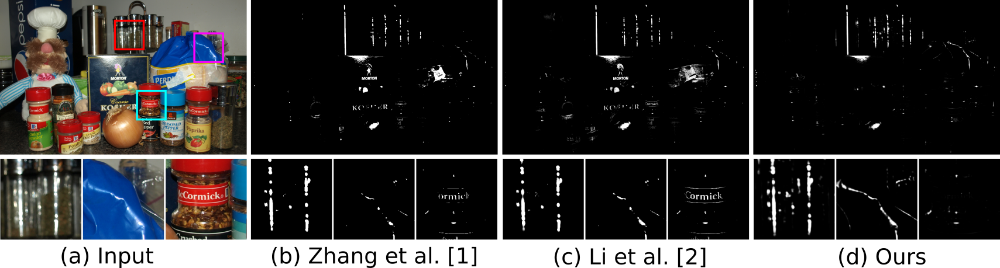

# Overview

This is the project about our SHDNet.

[Paper](https://dl.acm.org/doi/abs/10.1145/3394171.3413586), [Supplement](http://graphvision.whu.edu.cn/papers/supplement_SHDNet.pdf), and [Video](https://dl.acm.org/doi/abs/10.1145/3394171.3413586)


*Comparison with state-of-the-art highlight detection methods on an example image with very bright texts and materials.*

Learning to Detect Specular Highlights from Real-world Images

[Gang Fu](https://github.com/fu123456), [Qing Zhang](http://zhangqing-home.net/), QiFeng Lin, [Lei Zhu](https://appsrv.cse.cuhk.edu.hk/~lzhu/), and [Chunaxia Xiao](http://graphvision.whu.edu.cn/)

[ACM Multimedia 2020](https://2020.acmmm.org/)


Specular highlight detection is a challenging problem, and has many
applications such as shiny object detection and light source
estimation. Although various highlight detection methods have been
proposed, they fail to disambiguate bright material surfaces from
highlights, and cannot handle non-white-balanced images. Moreover, at
present, there is still no benchmark dataset for highlight
detection. In this paper, we present a large-scale real-world
highlight dataset containing a rich variety of material categories,
with diverse highlight shapes and appearances, in which each image is
with an annotated ground-truth mask. Based on the dataset, we develop
a deep learning-based specular highlight detection network (SHDNet)
leveraging multi-scale context contrasted features to accurately
detect specular highlights of varying scales. In addition, we design a
binary cross-entropy (BCE) loss and an intersection-over-union edge
(IoUE) loss for our network. Compared with existing highlight
detection methods, our method can accurately detect highlights of
different sizes, while effectively excluding the non- highlight
regions, such as bright materials, non-specular as well as colored
lighting, and even light sources.

If you have any questions about this project, please contact me via
Email: xyzgfu@gmail.com

# WHU-Specular dataset


*Example highlight images and corresponding highlight masks in our dataset. Please zoom in to view more details.*

WHU-Specular is a large dataset of annotated specular highlight
regions created from real-world images. It can be used for specular
highlight detection task. It contains 4310 image pairs (specular
images and corresponding highlight masks). We randomly selected 3,017
images as the training set, and other 1293 images as the testing set.
**Now, our full dataset is publicly available**. You can download our
dataset (size: 2G+) by Baidu Cloud (Link:
https://pan.baidu.com/s/1UizWty88XNhdI3PSNm0B-Q password: t3ov) and
Google Drive (Link:
https://drive.google.com/file/d/1yLSBr5tfYL-u4RyStX1sPmrJGCVuo0GB/view?usp=sharing.

# WHU-TRIIW dataset

You may be interested in our testing dataset of 500 real-world images in the wild.
This testing dataset is available at https://drive.google.com/file/d/1A-RDJUz6n3-tkxWNe0WGNxHKww3AkNig/view?usp=sharing (size:~826M) .
Most of images in this dataset are collected from Flickr. These images are often with a lot of white materials as well as texts, which means that
they are more challenging. So we can use them to validate the generality and robustness of our method and existing methods.
Some example images are shown in the below figure.


*Example testing images in the wild. They are collected from Flickr*

**Statement**. WHU-Specular dataset and WHU-TRIIW dataset are intended only for research
purposes and thus cannot be used commercially. Moreover, reference
must be made to the following publication when the dataet is used in
any academic and research reports.

```text
@inproceedings{fu-2020-learn-detec,
author = {Fu, Gang and Zhang, Qing and Lin, Qifeng and Zhu, Lei and Xiao, Chunxia},
title = {Learning to Detect Specular Highlights from Real-world Images},
booktitle = {ACM Multimedia},
year = {2020},
pages = {1873--1881},
}
```
# Compared methods

## Traditional highlight detection methods

Note that the authors of the paper [2] have not released their
code. Thus we have implemented their algorithm using Matlab ourselves. The code is in
*src/highlight_detection_tmi2019*.

The code of [3] is available at the project website [specularity-removal](https://github.com/muratkrty/specularity-removal).

The code of [4] is available at the project website [some_specular_detection_and_inapinting_methods_for_endoscope_image](https://github.com/jiemojiemo/some_specular_detection_and_inpainting_methods_for_endoscope_image).

## Other Learning-based detection methods in related fields

TODO ... ...

# References

[1] Zhang, W., Zhao, X., Morvan, J., & Chen, L. (2018). Improving
shadow suppression for illumination robust face recognition. IEEE
Transactions on Pattern Analysis and Machine Intelligence, 41(3),
611–624.

[2] Li, R., Pan, J., Si, Y., Yan, B., Hu, Y., & Qin, H. (2019). Specular
reflections removal for endoscopic image sequences with
adaptive-rpca decomposition. IEEE Transactions on Medical Imaging,
39(2), 328–340.

[3] Tchoulack, S., Langlois, J. M. P., & Cheriet, F. (2008). A video
stream processor for real-time detection and correction of specular
reflections in endoscopic images. In , Joint International IEEE
Northeast Workshop on Circuits and Systems and Taisa Conference.

[4] Meslouhi, O., Kardouchi, M., Allali, H., Gadi, T., & Benkaddour,
Y. (2011). Automatic detection and inpainting of specular
reflections for colposcopic images. Open Computer Science, 1(3),
341–354.


# Citation

If you use our dataset, please cite the following paper:

```text
@inproceedings{fu-2020-learn-detec,
author = {Fu, Gang and Zhang, Qing and Lin, Qifeng and Zhu, Lei and Xiao, Chunxia},
title = {Learning to Detect Specular Highlights from Real-world Images},
booktitle = {ACM Multimedia},
year = {2020},
pages = {1873--1881},
}
```
